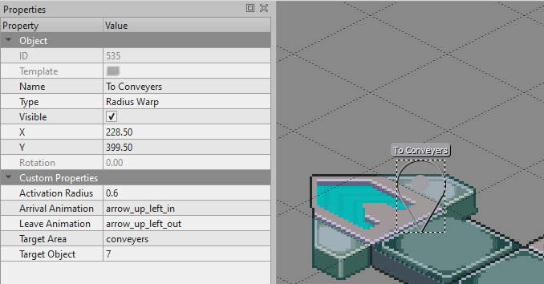

# ezlibs

# Installation
- copy / clone [ezlibs-scripts](https://github.com/Keristero/ezlibs-scripts/tree/master) into `server/scripts/ezlibs-scripts`
- copy / clone [ezlibs-assets](https://github.com/Keristero/ezlibs-assets/tree/master) into `server/assets/ezlibs-assets`
- create these folders
    - `server/memory/area/`
    - `server/memory/player/`
    - `server/encounters/`
    - `server/scripts/events/`

# Contents

# ezwarps
Automatically adds landings locations for server warps to your server, also handles arrival / leaving animations

Supported warp types:
- `Server Warp`
    - supports arrival animations
- `Custom Warp`
    - supports arrival animations
- `Interact Warp`
    - (a warp activated by interaction)
    - supports arrival animations
    - supports leaving animations
- `Radius Warp`
    - (a warp activated by entering its radius)
    - supports arrival animations
    - supports leaving animations

Supported warp custom properties:
- `Incoming Data` (string) secret to share with the server that is linking to you; for their `Data`
- `Warp In` (boolean) should the warp in animation be shown (laser from sky)
- `Warp Out` (boolean) should the warp out animation be shown (laser from sky)
- `Arrival Animation` (string) name of special animation which should play on warp in
- `Leave Animation` (string) name of special animation to play on warp out
- `Dont Teleport` (boolean) add this property if you just want the warp to animate, no teleporting

custom properties for warping to another server:
- `Address` (string) Ip address / hostname of server
- `Data` (string) unique string pre shared with the server so that the server can decide where transfered players should appear

custom properties for warping to another map:
- `Target Area` (string) name of area you want to transfer to, (same as filename, minus the .tmx)
- `Target Object` (string/object) id of object you want to teleport to

Radius Warp only:
- `Activation Radius` (float) the warp will activate when a player enters this radius


Special Animations (for arrival / leave animation):
- `fall_in`
- `lev_beast_in`
- `lev_beast_out`
- `arrow_up_left_out`
- `arrow_up_right_out`
- `arrow_down_left_out`
- `arrow_down_right_out`
- `arrow_up_left_in`
- `arrow_up_right_in`
- `arrow_down_left_in`
- `arrow_down_right_in`
- `fall_off_2`
- `log_in`
- `log_out`

## Usage Examples

### Making "Arrow Warps" using Radius Warp
Arrow A


Arrow B


More special animations can be added by requiring them in main.lua -> special_animations

# eznpcs
Automatically creates NPC's for your server based on objects you add to the map in Tiled.

You can create branching dialogue trees for conversations with NPCs all from the map editor, and if you want you can add scripted events for more complicated interactions.

You can create paths using waypoints in the map editor which the NPCs will follow, with optional wait times and random path selection.

## Setup
add objects to your map with Type=`NPC` on an object layer above the tile layer where you want the NPC to spawn.

### NPC Type
Custom properties:
- `Asset Name` string
    - name of npc tilesheet from `yourserver/assets/ezlibs-assets/eznpcs/sheet`
    - for example `heel-navi-exe4_black` (no file extension)
- `Mug Animation Name` string
    - name of a .animation file to use to animate the NPC's mugshot
    - the .animation file should be in the /mug folder
- `Direction` string
    - see the section on [`Directions`](#Directions).
- `Dialogue Type` string
    - by including this property, this npc will become interactable
    - see the section on [`Dialogues`](#Dialogues).
    - all the other dialogue properties can also be used here
- `Next Waypoint 1` object
    - by including this property, this npc will follow waypoints
    - Indicates the first waypoint that the npc should move to
    - see the section on [`Waypoints`](#Waypoints)


### Dialogues
any object can be a dialogue, you can use these custom properties to define what will happen next in the conversation when the dialogue is reached
Custom properties:
- `Dialogue Type` string
    - `first`
        - this dialogue will make the NPC say the first `Text #` custom property, usually `Text 1`
        - after `Text 1` is finished, 
    - `random`
        - this dialogue will choose a random `Text #` custom property to say, it might be `Text 1`, `Text 2`, `Text 5`, etc.
        - If there is a `Next #` property with a matching number, that dialogue will be triggered next, otherwise it will default to `Next 1`
    - `question`
        - prompts the player to choose yes or no, with `Text 1` as the prompt text
        - afterwards the dialogues `Next 1` or `Next 2` will be triggered, matching the player's choice.
    - `quiz`
        - presents up to 3 options based on `Text 1`, `Text 2`, and `Text 3`
        - afterwards the dialogues `Next 1`, `Next 2`, or `Next 3` will be triggered, matching the player's choice.
    - `before`
        - compares current time against [`Date`](#Date) custom property
        - if the current time is before `Date`, `Text 1` will be displayed, otherwise `Text 2`, it will go to the respective `Next x` dialogue node afterwards
    - `after`
        - same as `before`, checks if current time is after `Date`
    - `shop`
        - will open a shop where the player can buy items
        - add items to the shop with `Item #`(object) custom properties
            - item objects can have these properties [`Items`](#Items)
        - after the shop is closed the first `Next #` dialogue will be triggered
    - `item`
        - gives the player an item
        - specify items to be gifted `Item #`(object) custom properties
            - item objects can have these properties [`Items`](#Items)
        - by default a textbox will be sent saying "Got x Item", you can disable this with `Dont Notify` bool (*default is false)
    - `itemcheck`
        - checks if the player has the required items, `Next 1` will be triggered if requirements are met, otherwise `Next 2` will be triggered
        - if the `Take Item` custom property is set to `true`, all the required items will be taken from the player
        - specify item requirements with `Item #`(object) custom properties
            - item objects can have these properties [`Items`](#Items)
        
    - `password`
        - prompts the user for an input, if it matches the `Text 1` custom property, go to `Next 1` dialouge, otherwise go to `Next 2` dialogue
    - `none`
        - usually used with `Event Name`, no dialogue, but the event will still be triggered
        
- `Text 1` string
    - (numbered, you can also include, 2, 3, 4 etc. up to 10)
    - Text that will be spoken by NPCS who have this dialogue
- `Next 1` object
    - (numbered, you can also include, 2, 3, 4 etc. up to 10)
    - ID of the next dialogue to activate after the corresponding Text is spoken / chosen
- `Event Name` string
    - Name of event to activate when this dialogue starts, events can be added in your eznpcs entry script, see [`Dialogue Events`](#DialogueEvents) for details.
- `Mugshot` string
    - Override the speaking bot's mugshot with another one for this dialogue node.
    - for example, even though `prog` is speaking, we can make it display Bass' mugshot by setting `Mugshot` to `bass`
    - There is a special value `player` which will get the mugshot of the player talking to the NPC, useful for back and forth conversations

### Items
- `Name` string
- `Description` string (*default is ???*)
- `Type` string
    - `item` (default)
    - `money`
    - `keyitem`
- `Price` int (*default is 9999999*), only used for shops
- `Amount` int (*default is 1*), not used by shops

### Waypoints
any object can be a waypoint, you can use these custom properties to define what the NPC will do once it reaches said object.
Custom properties:
- `Waypoint Type` string
    - `first`
        - after reaching this waypoint, the NPC will head to the waypoint referenced by the first `Next Waypoint #` custom property, usually `Next Waypoint 1`
    - `random`
        - after reaching this waypoint, the next one will be selected from a random `Next Waypoint #` custom property.
    - `before`
        - compares current time against [`Date`](#Date) custom property
        - if the current time is before `Date`, `Next Waypoint 1` will be next, otherwise `Next Waypoint 2` will be.
    - `after`
        - same as `before`, checks if current time is after `Date`
- `Wait Time` number
    - time in seconds to wait before moving to next waypoint
- `Direction` string
    - direction to face while waiting
    - see the section on [`Directions`](#Directions).
- `Waypoint Event` string
    - coming soon

### Date
the `Date` custom property can be used for time based conditions on Dialogue nodes and Waypoints
the format is a super duper basic cron like format. there are 6 numbers seperated by spaces for each part of the date string

`second` `minute` `hour` `day` `month` `year`

you can hardcode a specific date and time like this:

`0 0 13 1 1 2000` (1pm on first of january year 2000)

or you can use wildcards which will always behave as the current time for that column

`30 * * * * *` (30 seconds through the current minute, today)


### Interact Relay
- any object with the custom property `Interact Relay` (object) that is interacted with will start a conversation with the NPC that it is referencing
- useful for starting conversations with NPCS that are behind objects like counters

### DialogueEvents
- you can add custom logic for dialogues using `eznpcs.add_event(event_object)`
- dialogue events must return promises, see the example
- eznpcs will automatically try and load the file `/server/scripts/events/eznpcs_events.lua` for this purpose, so create that file and add events from there
- loaded events will activated when a player reaches a dialogue during a conversation with a matching `Event Name` custom property
- the action of the event is a callback which allows for any and all custom interactions.
- callback parameters:
    - `npc` table
        - information about the NPC who the player is conversing with
    - `player_id` string
        - id of the player who engaged the npc in conversation
    - `dialogue` table
        - information about the dialogue object
    - `relay_object` table
        - information about the relay object which the player started their conversation with the NPC through
        - nil if the player did not start conversing using a relay object
- expected return types
    - nil
        - will end the conversation
    - number
        - id of the next dialogue object that you want to trigger after this, usually get it from a custom property on the current dialogue object.

*Here is an example dialogue event where a sound effect plays and the player enjoys gravy*
```lua
local eznpcs = require('scripts/ezlibs-scripts/eznpcs/eznpcs')
local sfx = {
    recover='/server/assets/ezlibs-assets/sfx/recover.ogg',
}
local some_event = {
    name = "Drink Gravy",
    action = function(npc, player_id, dialogue, relay_object)
        return async(function()
            local player_mugshot = Net.get_player_mugshot(player_id)
            Net.play_sound_for_player(player_id, sfx.recover)
            Net.message_player(player_id, "\x01...\x01mmm gravy yum", player_mugshot.texture_path, player_mugshot.animation_path)
            return dialogue.custom_properties["Next 1"]
        end)
    end
}
eznpcs.add_event(some_event)
```
if you add this example to `/server/scripts/events/eznpcs_events.lua` you should see it load when you start the server
### Waypoint Events
- coming soon

### Misc
#### Directions
- `Left`
- `Right`
- `Up`
- `Down`
- `Up Left`
- `Up Right`
- `Down Left`
- `Down Right`

# ezmystery
lets you place mystery data objects on your maps to give players key items and money

## Setup
add objects to your map with Type=`Mystery Datum` on an object layer above the tile layer where you want the Mystery data to spawn

### Randomizing Spawns
you can specify the minimum and maximum number of green data that you wish to spawn on any given map by adding these properties to your map.
By default this behaviour is disabled unless you specify a valid minimum and maximum
- `Mystery Data Minimum` (number)
    - minimum number of green data that you wish to appear per jack in.
- `Mystery Data Maximum` (number)
    - maximum number of green data that you wish to appear per jack in.

### Mystery Dataum
Custom properties:
(Same as [`Items`](#Items) with the following extras)
- `Type` string
        - random
- `Next #`: object
    - You can have up to 9 of these, named `Next 1`, `Next 2` etc
    - if using the `random` type, the reward will be selected from a `Mystery Option` type object; randomly selected from a `Next #` property
- `Once` boolean
    - like a blue or purple mystery data, this mystery data will never appear again for this player
- `Locked` boolean
    - like a purple mystery data, requires an item named `Unlocker` to open

### Mystery Option
Custom properties:
- (all the same properties as mystery datum, but these are exclusively for providing random rewards as they will be removed from the map when the server loads)

# ezmemory
provides easyish saving and loading of things, this library is only interacted with through lua

you can clear all information stored by ezmemory by deleting the files in the `/server/memory/` folder that we created during setup

as long as you use the ezmemory functions (as opposed to the built in equivilants) ezmemory will automatically persist player money, items, key items, and any other table data you want.

note that if you create an item which is not a key item, it will not show up anywhere, this can still be useful for your own custom scripts.

```lua
local new_item_id = ezmemory.create_or_update_item(item_name,item_description,is_key)
```
- if an item with is_key is given to a player it will show in keyitems
- if an item with the same name already exists; the details will be updated, this wont update in the players key items until the player reconnects

```lua
local new_item_count = ezmemory.give_player_item(player_id, item_name, amount)
```
- will return `nil` if the item you attempted to give the player has not been created using `ezmemory.create_or_update_item`

```lua
local item_count = ezmemory.count_player_item(player_id, item_name)
```

```lua
ezmemory.set_player_money(player_id, money)
```

```lua
local success = ezmemory.spend_player_money(player_id, amount)
```
- spends the specified amount of money if the player has enough
- returns `true` if the player had enough money, otherwise returns `false`

these have been the main functions, but there are more to see in the ezmemory.lua file

# ezencounters
handle enemy encounters, and trigger random ones from a table for each map

create a lua file for each map with the same name as the tiled map (`default.lua` for example)
and put the file into the `server/encounters/` (create this folder if it does not exist)

encounter options:
- name (string)
    - if provided, this name can be used to trigger encounters by name, the encounter still needs to be added to a encounter table
- path (string)
    - path to the main encounter file, usually this will be the same as in the examples, but if you want to create your own .zip you can specify it here, note you will need to copy/modify the code from the provided ezencounters.zip
- weight (number)
    - relative chance of this particular encounter being picked from table for this area, if one encounter has weight 10 and another has weight 20, the weight 20 one is twice as likely to be picked.
- enemies (table)
    - ordered list of all the enemies you want to include in the battle
    - ranks key
        - 1 `v1`
        - 2 `v2`
        - 3 `v3`
        - 4 `sp`
        - 5 `ex`
        - 6 `rare1`
        - 7 `rare2`
        - 8 `nightmare`
    - here are all the mobs and available ranks included by default in ezencounters.zip
        - `Mettaur` (1,2,3,4,6,7)
        - `Champy` (1,2)
        - `Chimpy` (1) ~thanks jamesking#9809
        - `Chumpy` (1) ~thanks jamesking#9809
        - `RareChampy` (1) ~thanks jamesking#9809
        - `Gunner` (1,4,6,7)
        - `Shooter` (1,4)
        - `Sniper` (1)
        - `BigBrute` (1)
        - `Cactikil` (1,5) ~Author Konstinople#7692
        - `Cactroll` (1,5) ~Author Konstinople#7692
        - `Cacter` (1,5) ~Author Konstinople#7692
        - `Powie` (1,5) ~Author Konstinople#7692
        - `Powie2` (1,5) ~Author Konstinople#7692
        - `Powie3` (1,5) ~Author Konstinople#7692
        - `Spikey` (1,2,3) ~Author DawnOwl#5358
        - `Canodumb` (1,2,3) ~Author Konstinople#7692
        - `Canosmart` (1) ~Author DawnOwl#5358
        - `Volgear` (1,2,3,4) ~Author LouisE#9864
        - `KillerEye` (1,4,6,7) ~Author LouisE#9864
        - `DemonEye` (1) ~Author LouisE#9864
        - `JokerEye` (1) ~Author LouisE#9864
        - `HauntedCandle` (1,2,3,4,6,7) ~Author LouisE#9864
        - `Fishy` (1,2,3,4) ~Author LouisE#9864
        - `BombCorn` (1,4,6,7) ~Author LouisE#9864
        - `JokerEye` (1) ~Author LouisE#9864
        - `MegaCorn` (1) ~Author LouisE#9864
        - `GigaCorn` (1) ~Author LouisE#9864
        - `Bladia` (1) ~Author DawnOwl#5358
        - `Metrid` (1,2,3,4) ~Author DawnOwl#5358
        - `Basher` (1) ~Author DawnOwl#5358
        - `FighterPlane` (1,2,3,4) ~Author DawnOwl#5358
        - `Catack` (1,2,3,4) ~Author DawnOwl#5358
        - `Ratty` (1,2,3,4) ~Author DawnOwl#5358
        - `Yort` (1,2,3,4,6,7,8) ~Author LouisE#9864
        - `Volcano` (1,2,3,4,6,7,8) ~Author LouisE#9864
        - `Swordy` (1,2,3,4,8) ~Author LouisE#9864
        - `Skarab` (1,4,6,7,8) ~Author LouisE#9864
        - `Skarry` (1) ~Author LouisE#9864
        - `Skelly` (1) ~Author LouisE#9864
        - `Scutz` (1) ~Author LouisE#9864
        - `Scuttle` (1) ~Author LouisE#9864
        - `Scuttler` (1) ~Author LouisE#9864
        - `Scuttzer` (1) ~Author LouisE#9864
        - `Scuttlest` (1,4) ~Author LouisE#9864
        - `Lark` (1,4,6,7,8) ~Author LouisE#9864
        - `Bark` (1) ~Author LouisE#9864
        - `Tark` (1) ~Author LouisE#9864
        - `Flashy` (1) ~Author LouisE#9864
        - `DthFire` (1,4,6,7,8) ~Author LouisE#9864
        - `FulFire` (1,4,6,7,8) ~Author LouisE#9864
        - `MetFire` (1,4,6,7,8) ~Author LouisE#9864
        - `Elemperor` (1,2,3,4,6,7,8) ~Author LouisE#9864
        - `Dominerd` (1,2,3,4,8) ~Author LouisE#9864
        - `Cragger` (1,2,3,4,6,7,8) ~Author LouisE#9864
        - `DarkMech` (1,2,3,4,6,7) ~Honest Signal#7759
        - `CirKill` (1,4,6,7,8) ~Author LouisE#9864
        - `CirCrush` (1) ~Author LouisE#9864
        - `CirSmash` (1) ~Author LouisE#9864
        - `WindBox` (1,2,3,4,8) ~Author LouisE#9864
        - `VacuumFan` (1,2,3,4) ~Author LouisE#9864
        - `OldStove` (1,4,6,7,8) ~Author LouisE#9864
        - `OldHeater` (1) ~Author LouisE#9864
        - `OldBurner` (1) ~Author LouisE#9864
        - `Bunny` (1) ~Author LouisE#9864
        - `TuffBunny` (1) ~Author LouisE#9864
        - `MegaBunny` (1) ~Author LouisE#9864
        - `Bugtank` (1) ~Author LouisE#9864 ??? Versions to be documented
        - `Shrimpy` (1) ~Author LouisE#9864 ??? Versions to be documented
        - `Puffy` (1) ~Author LouisE#9864 ??? Versions to be documented
        - `HotHead` (1) ~Author LouisE#9864 ??? Versions to be documented
        - `ColdHead` (1) ~Author LouisE#9864 ??? Versions to be documented
        - `HardHead` (1) ~Author LouisE#9864 ??? Versions to be documented
        - `Gloomer` (1) ~Author LouisE#9864 ??? Versions to be documented
        - `Doomer` (1) ~Author LouisE#9864 ??? Versions to be documented
        - `Boomer` (1) ~Author LouisE#9864 ??? Versions to be documented
        - `Piranha` (1) ~Author LouisE#9864 ??? Versions to be documented
        - `Breaker` (1) ~Author LouisE#9864 ??? Versions to be documented
        - `Shaker` (1) ~Author LouisE#9864 ??? Versions to be documented
        - `Quaker` (1) ~Author LouisE#9864 ??? Versions to be documented

- positions (grid)
    - where to spawn each enemy, 0 = no enemy, to spawn an enemy use the index of the enemy you listed in the enemies table you provided (1 = enemy at index 1 in your enemies table)
- tiles (grid)
    - defaults to all normal panels
1. `normal`
2. `cracked`
3. `broken`
4. `up`
5. `down`
6. `left`
7. `right`
8. `empty`
9. `grass`
10. `hidden`
11. `holy`
12. `ice`
13. `lava`
14. `poison`
15. `volcano`

- teams (grid)
    - defaults to the usual battle field
0. neutral team
1. blue team
2. red team

- obstacles (table)
    - ordered list of all the obstacles you want to include
    - here are the included obstacles
        - RockCube
        - Rock
        - Coffin
        - BlastCube
        - IceCube
        - MysteryData

- obstacle_positions(table)
    - like enemy_positions, but for obstacles

- player_positions(table)
    - like enemy_positions, but for players.

- freedom_mission(table)
    - turns (number)
    - can_flip (boolean)

- music (table)
    - path (string), included options:
        - `bcc_battle_xg.mid`
        - `bcc_battle.mid`
        - `bn1_battle_xg.mid`
        - `bn1_battle.mid`
        - `bn1_boss_xg.mid`
        - `bn1_boss.mid`
        - `bn2_battle.mid`
        - `bn2_boss.mid`
        - `bn3_battle.mid`
        - `bn3_boss.mid`
        - `bn3_tournament.mid`
        - `bn4_battle.mid`
        - `bn4_boss.mid`
        - `bn4_tournament.mid`
        - `bn5_battle_xg.mid`
        - `bn5_battle.mid`
        - `bn5_boss_xg.mid`
        - `bn5_boss.mid`
        - `bn6_battle_xg.mid`
        - `bn6_battle.mid`
        - `bn6_boss_xg.mid`
        - `bn6_boss.mid`
        - `bn45_battle_xg.mid`
        - `bn45_tournament_final.mid`

here is an example of the contents, in this case just one potential encounter layout with some mettaurs and a champy

```lua
local encounter1 = {
    path="/server/assets/ezlibs-assets/ezencounters/ezencounters.zip",
    weight=10,
    enemies = {
        {name="Mettaur",rank=1},
        {name="Champy",rank=1},
    },
    positions = {
        {0,0,0,0,0,2},
        {0,0,0,0,1,0},
        {0,0,0,1,0,0}
    },
    results_callback = give_result_awards --function (player_id,encounter_info,stats)
}

return {
    minimum_steps_before_encounter=400,
    encounter_chance_per_step=0.01,
    encounters={encounter1}
}
```

here is another example with every optional field included
```lua
local encounter1 = {
    name="example encounter"
    path="/server/assets/ezlibs-assets/ezencounters/ezencounters.zip",
    weight=10,
    enemies = {
        {name="BigBrute",rank=1,max_hp=500,starting_hp=500,nickname="Doggie"},
        {name="Gunner",rank=1},
    },
    positions = {
        {0,0,0,0,0,2},
        {0,0,0,0,1,0},
        {0,0,0,0,0,2}
    },
    tiles = {
        {1,1,9,9,1,1},
        {1,1,9,9,1,1},
        {1,1,9,9,1,1}
    },
    teams = {
        {2,2,0,0,1,1},
        {2,2,0,0,1,1},
        {2,2,0,0,1,1}
    },
    obstacles = {
        {name="RockCube"},
    },
    obstacle_positions = {
        {0,0,1,1,0,0},
        {0,0,1,1,0,0},
        {0,0,1,1,0,0}
    },
    player_positions = {
        {0,0,0,0,0,0},
        {1,0,0,0,0,0},
        {0,0,0,0,0,0}
    },
    freedom_mission={
        turn_count=5,
        player_can_flip=true
    },
    music={
        path="bcc_battle.mid"
    }
}

return {
    minimum_steps_before_encounter=50,
    encounter_chance_per_step=0.1,
    encounters={encounter1}
}
```

you can also specify a results calback (as seen above) which will be called at the end of the battle;
here we are requiring ezmemory in order to give the player some reward monies for winning the battle

```lua
local ezmemory = require('scripts/ezlibs-scripts/ezmemory')

local sfx = {
    item_get='/server/assets/ezlibs-assets/sfx/item_get.ogg'
}

local give_result_awards = function (player_id,encounter_info,stats)
    -- stats = { health: number, score: number, time: number, ran: bool, emotion: number, turns: number, npcs: { id: String, health: number }[] }
    -- set the player emotion if they left the battle with full sync (1)
    if stats.emotion == 1 then
        Net.set_player_emotion(player_id, stats.emotion)
    else
        Net.set_player_emotion(player_id, 0)
    end
    -- set the player health to whatever they finished the battle with
    Net.set_player_health(player_id,stats.health)
    if stats.ran then
        return -- no rewards for wimps
    end
    local reward_monies = (stats.score*50)
    ezmemory.spend_player_money(player_id,-reward_monies) -- spending money backwards gives money
    Net.message_player(player_id,"Got $"..reward_monies.."!")
    Net.play_sound_for_player(player_id,sfx.item_get)
end
```

## Radius Encounters
You can create an object with type `Radius Encounter` which will trigger an encounter the first time a player reaches it.
Custom Properties:
- `Name` (string) name of the encounter (from encounter table) to activate
- `Path` (string) if name is not specified, you can trigger an encounter with a mob package zip by specifying it's path
- `Once` (boolean) if true, this encounter will never appear again for this player after they beat it

# ezcheckpoints
Lets you create checkpoints such as security cubes or gates with unlock requirements

Type: `Checkpoint`
Custom Properties:
- `Description` (string) message sent to the player when they inspect the cube
- `Unlocking Asset Name` (string) the asset name of the unlocking animation,
    Examples built in:
    - `bn5cubegreen_bot`
- `Unlocking Animation Time` (float) the time to display the cube unlock animation for, if you set this too long the animation will loop
- `Password` (string) you can specify a password that the user will be prompted to input
    (note, the password is currently stored in the map file so its not very secure)
- `Key Name` (string) you may specify an item name here which will be required to unlock the checkpoint
    you can set this to `money` to require money for unlocking the cube
- `Required Keys` (number) the number of keys required to open the checkpoint
- `Consume` (bool) set to true if you want the required item/money to be consumed after unlocking
- `Skip Prompt` (bool) usually the player is prompted to ask if they want to try unlocking the cube with an item/money, this will skip that confirmation (if true)
- `Unlocked Message` (string) a message to send the player when they unlock the cube
- `Unlock Failed Message` (string) a message to send the player when they fail to unlock the cube
- `Once` (bool) set to true if you want this cube to never appear again for this player after they unlock the cube
- 


# ezweather
lets you control the weather per map

## Setup
add some extra properties to your map file if you want to

```lua
ezweather.start_rain_in_area(area_id)
```
- if you specify a `Rain Song` custom property on your map, it will play while it is raining

```lua
ezweather.start_snow_in_area(area_id)
```
- if you specify a `Snow Song` custom property on your map, it will play while it is snowing

```lua
ezweather.clear_weather_in_area(area_id)
```
- restores the original foreground and `Song`

# ezfarms
a large plugin which adds a harvest moon style farming system to your server. but it is a pain to set up so disable it by removing it from the start of main.lua (and the plugin list in main.lua)

# custom plugin
If you need to add your own logic that interacts with ezlibs outside of dialogue events / encounter results - 
create this file `/server/scripts/ezlibs-custom/custom.lua` and you can add your own custom plugin which will be automatically added by ezlibs main
```lua
local ezmemory = require('scripts/ezlibs-scripts/ezmemory')

local custom = {}

custom.on_tick = function (dt)
    print('custom plugin!')
end

return custom
```
